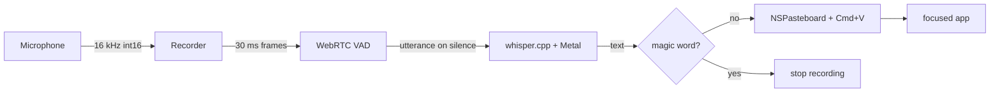

# Genie

Local Whisper dictation as a macOS menu bar app.

Press a global hotkey (default <kbd>§</kbd>, the key just left of <kbd>1</kbd> on Finnish/ISO Mac keyboards) or click the menu bar icon to start recording. Genie streams your speech through [whisper.cpp](https://github.com/ggerganov/whisper.cpp) (Metal-accelerated), and pastes the transcript into the focused input as you speak. Say a magic word (default `genie`) to stop.

Everything runs locally. No audio leaves your machine.

## Features

- Local-only speech recognition via whisper.cpp + Metal on Apple Silicon
- User-configurable global hotkey (any key + any combination of ⌘/⌃/⌥/⇧)
- Magic-word stop phrase, case-insensitive, whole-word match
- Clipboard-based text injection that restores your previous clipboard ~250 ms after pasting
- Menu-bar-only app (no Dock icon, no window in the way)
- Settings UI for permissions, model download, language, hotkey, magic word

## Requirements

- macOS 11 or newer (Apple Silicon recommended for Metal acceleration)
- Xcode command line tools: `xcode-select --install`
- [Go 1.23+](https://go.dev/dl/), [Node 18+](https://nodejs.org/), [`cmake`](https://cmake.org/), [`git`](https://git-scm.com/)
- [Wails v2 CLI](https://wails.io/docs/gettingstarted/installation): `go install github.com/wailsapp/wails/v2/cmd/wails@latest` and add `~/go/bin` to your `PATH`
- Python 3 + Pillow if you want to regenerate the app icon: `pip3 install Pillow`

## Quick start

```bash
git clone https://github.com/jonmakinen/genie.git
cd genie
make whisper        # clones third_party/whisper.cpp and builds it with Metal
make build          # builds build/bin/genie.app
make install        # copies it to /Applications (so Spotlight finds it)
make install-cli    # adds the `genie` shell wrapper to /usr/local/bin
make launch         # opens the app
```

`install` and `install-cli` will transparently prompt for `sudo` when the destination isn't user-writable (e.g. `/usr/local/bin` on macOS). Override the destinations to skip sudo entirely:

```bash
make install-cli BIN_DEST="$HOME/.local/bin"   # then add it to PATH
make install     APP_DEST="$HOME/Applications" # user-only Applications folder
```

The Dock won't show an icon (`LSUIElement=true`). Look for the mic glyph in the menu bar (top right of the screen, near the clock).

On first launch:

1. Click the menu bar icon → **Settings…**
2. Grant **Microphone** and **Accessibility** permissions when prompted. Both are required: microphone for capture, Accessibility for the global hotkey and synthetic Cmd+V.
3. In the **Model** section, click **Download** next to `large-v3-turbo (q5_0, ~870 MB)`. The model is saved to `~/Library/Application Support/Genie/models/`.
4. Click into any text input on your computer, press <kbd>§</kbd>, speak, and say `genie` to stop. The transcript pastes itself in.

For development with frontend hot reload:

```bash
make dev            # runs `wails dev`
```

## Running it

Once installed, you can launch Genie any of these ways:

- **Spotlight**: <kbd>⌘</kbd>+<kbd>Space</kbd> → "Genie"
- **Finder**: open `/Applications/Genie.app`
- **Terminal**: `genie` (after `make install-cli`) or `open -a Genie`

Use `GENIE_APP=/path/to/Genie.app genie` if you want the wrapper to point at a non-installed copy (e.g. a dev build).

## Launch at login

Two equivalent ways to make Genie start automatically when you log in:

1. **From inside Genie** (macOS 13+): Settings → Behavior → toggle **Launch at login**. The first time you enable it, macOS may show a "requires approval" hint — open System Settings → General → Login Items & Extensions and confirm Genie.
2. **From System Settings**: System Settings → General → Login Items & Extensions → **+** → pick `Genie.app`.

To stop launching at login, untoggle the same checkbox or remove Genie from the Login Items list.

## Architecture



Audio is captured at 16 kHz mono via [malgo](https://github.com/gen2brain/malgo) and split into 30 ms frames. WebRTC VAD groups voiced frames into utterances on ~500 ms of trailing silence. Each utterance is transcribed in-process by whisper.cpp; the result is scanned for the magic word and the prefix is injected into the focused app via `NSPasteboard` + a synthesized Cmd+V. The clipboard is restored shortly after.

## Configuration

Settings persist to `~/Library/Application Support/Genie/config.json`:

| Key | Type | Default | Notes |
| --- | --- | --- | --- |
| `model_name` | string | `ggml-large-v3-turbo-q5_0.bin` | Filename in `~/Library/Application Support/Genie/models/` |
| `magic_word` | string | `genie` | Whole-word, case-insensitive match in transcripts |
| `hotkey_enabled` | bool | `true` | Toggle the global shortcut without losing the binding |
| `hotkey.code` | uint16 | `0x0A` (§ / ISO) | macOS virtual keycode (`kVK_*` from HIToolbox) |
| `hotkey.cmd` / `ctrl` / `shift` / `alt` | bool | `false` | Modifier flags |
| `hotkey.label` | string | `§` | Display label for the settings UI |
| `language` | string | `auto` | `auto` or an ISO code (`en`, `fi`, `sv`, `de`, `fr`, `es`, …) |

The same values are exposed in the Settings window, including a hotkey-capture button.

## Project layout

```
.
├── main.go, app.go             # Wails entrypoint + frontend-bound methods
├── internal/
│   ├── audio/                  # malgo capture (16 kHz mono int16)
│   ├── vad/                    # WebRTC VAD utterance splitter
│   ├── transcribe/             # whisper.cpp wrapper
│   ├── inject/                 # NSPasteboard + Cmd+V via cgo
│   ├── hotkey/                 # global hotkey via Carbon
│   ├── tray/                   # NSStatusItem (cgo .m file)
│   ├── permissions/            # mic + accessibility status / prompts
│   ├── modeldownload/          # ggml model downloader
│   ├── pipeline/               # mic → vad → whisper → magic-word → inject
│   ├── keycode/                # W3C event.code → macOS virtual keycode
│   └── config/                 # JSON-backed settings store
├── frontend/                   # Svelte settings window
├── build/darwin/Info.plist     # LSUIElement=true, mic usage description
├── scripts/make_icon.py        # programmatic app icon generator
├── third_party/whisper.cpp/    # gitignored; populated by `make whisper`
└── Makefile
```

## Troubleshooting

- **No menu bar icon after launch.** The app is `LSUIElement` so it has no Dock entry. Check the menu bar near the clock. If still missing, run from a terminal: `./build/bin/genie.app/Contents/MacOS/Genie` and watch stderr.
- **Hotkey doesn't fire.** Accessibility permission is required for global hotkeys. Settings → Permissions → Grant. If Genie is in the Accessibility list but checked-off, toggle it off and on again.
- **No text gets pasted.** Same — Accessibility is required to synthesize Cmd+V into other apps.
- **Recording starts but transcripts never appear.** Make sure a model is downloaded and shown as `installed` and `active` in Settings → Model. The first transcribe call also has a small JIT-style warm-up on Metal.
- **`make whisper` fails on a path with non-ASCII characters.** clang's Objective-C frontend chokes on some Unicode in absolute paths. The Makefile already symlinks the workspace into `/tmp/genie-build-<hash>` and runs cmake from there, so this should "just work" — if it doesn't, delete `third_party/whisper.cpp/build` and re-run.
- **Resetting state.** Delete `~/Library/Application Support/Genie/` to wipe config + models.

## License

MIT — see [LICENSE](LICENSE).

whisper.cpp is MIT-licensed by ggerganov; the Whisper model weights are MIT-licensed by OpenAI. malgo wraps miniaudio (public domain). go-webrtcvad wraps Google's WebRTC VAD (BSD-3).
